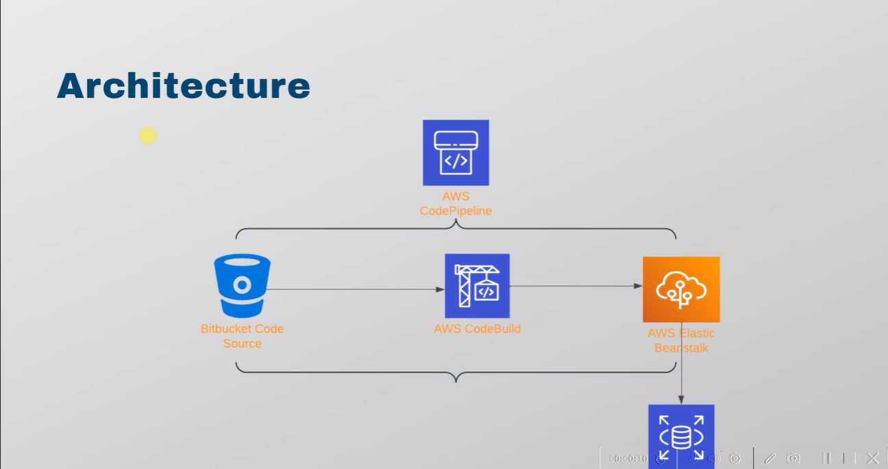

# 🚀 Java Application CI/CD on AWS with Elastic Beanstalk & RDS

A **DevOps pipeline project** demonstrating complete CI/CD automation for a Java-based web application using **Bitbucket, AWS CodePipeline, CodeBuild, Elastic Beanstalk, S3**, and **Amazon RDS MySQL**.

---

## **🔧 Tech Stack**

- ☕ **Java 17 (Corretto)**
- 📦 **Maven**
- 🧪 **AWS CodeBuild**
- 🔁 **AWS CodePipeline**
- ☁️ **Elastic Beanstalk**
- 🗄️ **Amazon RDS (MySQL)**
- 🗃️ **S3 (Artifact Storage)**
- 🔒 **SSM Parameter Store for secrets**
- 📊 **CloudWatch (Monitoring)**

---

## **📚 Project Overview**

This project showcases a **fully automated CI/CD pipeline** for deploying the `VProfile` Java web application on AWS, using:

- 🧾 **Bitbucket** as the version control system  
- 🧱 **CodeBuild** for building & packaging  
- 📦 **S3** for storing artifacts  
- 🚢 **Elastic Beanstalk** for deploying the application  
- 🗄️ **Amazon RDS** for MySQL backend  
- 🔁 **CodePipeline** to orchestrate everything

---

## **🧭 Architecture Diagram**




---

## 🗂️ Key Components

| Component           | Description                              |
|--------------------|------------------------------------------|
| **Bitbucket**       | Source Code Management                   |
| **CodeBuild**       | Builds Java application using Maven      |
| **CodePipeline**    | Automates the CI/CD flow                 |
| **Elastic Beanstalk** | Java Application Hosting              |
| **Amazon RDS**      | MySQL Database                           |
| **S3**              | Stores compiled build artifacts          |

---

## 🗃️ Database Configuration

### 🔧 RDS Instance Details

- **Endpoint**: `vprords.c1ikcm2m84ek.us-east-1.rds.amazonaws.com:3306`
- **Engine**: MySQL Community 8.0.35
- **Availability Zone**: `us-east-1d`
- **Security**: Private (Not Publicly Accessible)
- **VPC**: `vpc-0c15a5f6da8e4e21`


### 🧱 Schema Tables

- `user`: Stores user profiles and credentials
- `role`: Defines user roles (`ROLE_USER`, etc.)
- `user_role`: Junction table for user-role mapping

### 🧨 Initialization SQL

```sql
CREATE TABLE user (...);
CREATE TABLE role (...);
CREATE TABLE user_role (...);

---

## **Restore with:**

bash

mysql -h [endpoint] -u admin -p < db_backup.sql

---

🏗️ Build Process (buildspec.yml)

version: 0.2

phases:
  install:
    runtime-versions:
      java: corretto17

  pre_build:
    commands:
      - apt-get update
      - apt-get install -y jq
      - wget https://archive.apache.org/dist/maven/maven-3/3.9.8/binaries/apache-maven-3.9.8-bin.tar.gz
      - tar xzf apache-maven-3.9.8-bin.tar.gz
      - ln -s apache-maven-3.9.8 maven
      - sed -i 's/.../.../' src/main/resources/application.properties

  build:
    commands:
      - mvn install

  post_build:
    commands:
      - mvn package

artifacts:
  files:
    - '**/*'
  base-directory: 'target/vprofile-v2'

---

🔁 Deployment Pipeline

Pipeline Stages
Source: Bitbucket repo triggers pipeline

Build: Runs buildspec.yml via CodeBuild

Deploy: Artifacts deployed to Elastic Beanstalk

---

🧑‍💻 Accessing the Application
🔐 Default Login
Username: admin_vp

Password: (stored hashed in DB)

✅ Sample Users
The app is pre-loaded with users of various roles for demo purposes.

---

🔒 Security Practices
❌ RDS not publicly accessible

🔐 Secrets stored in SSM Parameter Store

🔐 Passwords hashed with BCrypt

🔐 IAM roles follow least privilege

🔐 S3 artifacts encrypted

🔐 VPC + SGs used for traffic control

---

📊 Monitoring & Debugging
🔍 CloudWatch logs and metrics

🟢 Elastic Beanstalk health dashboard

🔁 Pipeline execution history

🛠️ RDS performance metrics

---

🚀 Getting Started (Deploy Your Own)
✅ Prerequisites
AWS Account

Bitbucket Repository

MySQL Client

🔧 Setup Guide
Create RDS MySQL instance

Restore DB using db_backup.sql

Upload source to Bitbucket

Create S3 bucket for artifacts

Setup CodeBuild with buildspec.yml

Setup Elastic Beanstalk Environment

Create CodePipeline:

Source (Bitbucket)

Build (CodeBuild)

Deploy (Elastic Beanstalk)

---

## 🛠️ Troubleshooting

| Issue             | Fix                                |
|------------------|-------------------------------------|
| ❌ Build fails    | Check CodeBuild logs                |
| 🔌 DB errors      | Check RDS connectivity              |
| ⛔ Deploy fails   | Check EB logs & health              |
| 💤 Pipeline stalls | Check for manual approvals          |


---

## 🚀 Future Enhancements
✅ Add automated testing stage

🔁 Implement blue-green deployments

🛡️ Integrate security scanning tools

⚙️ Use AWS CDK for full IAC

📢 Add Slack notifications